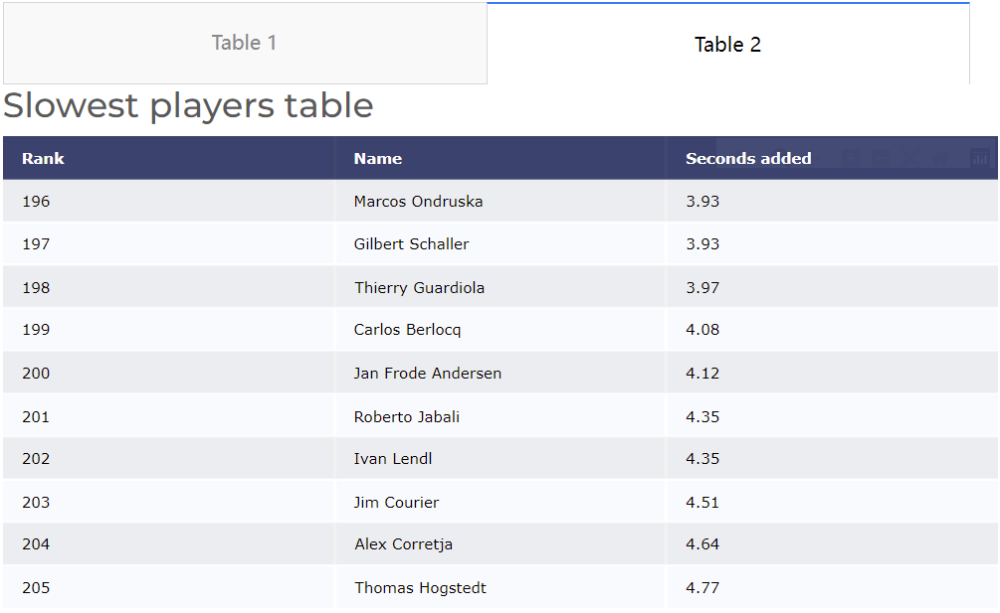

# COMP0034 Coursework 1

##Repository URL

https://github.com/ucl-comp0035/comp0034-cw1-i-COMPoo35
## Visualisation design
This README file aims to explain and evaluate the design of visualisation.

Visualisations are going to answer questions for a particular target audience.

Tennis is not bounded by a clock, but it does keep time. 
The problem is that tennis matches always took a long time in past decades. 
More specifically, it takes a tennis player a long time to score each point. 

### Target audience

https://github.com/ucl-comp0035/comp0034-cw1-i-COMPoo35/blob/master/Figures%20in%20README/target_audience.png

The target audience is shown in the above persona. He is a young tennis fans as well as an engineering student, who is
greatly interested in tennis matches and related data analysis. He is looking for an app for reading analysis and 
understanding more about tennis matches. With this app, he should be able to find the data about his favourite players.

### Question to be addressed.
1. How does the venue of different events affect tennis matches time? Any trends?
2. Who can score quickly in a match? Any notable players?
3. How is the average performance of players to win a point?
4. How can the target audience be able to find the data about his favourite player?

### Explanation and Evaluation of Visualisations
#
#### Visualisation 1

https://github.com/ucl-comp0035/comp0034-cw1-i-COMPoo35/blob/master/Figures%20in%20README/fastest_tournaments_table.png

https://github.com/ucl-comp0035/comp0034-cw1-i-COMPoo35/blob/master/Figures%20in%20README/slowest_tournaments_table.png

Extreme values are most likely to attract the reader's interest. A tab selector is applied to accommodate two tables in
one display region, which allows readers to switch tables freely. This can reduce the region required for the web page to display tables.
The first visualisation is taken from a data frame containing more than 200 pieces of data, which shows the top 20 tournaments for player to win a point.
The four fastest tournaments are on grass — with Wimbledon the fastest. The 10 slowest are all on clay. 
The rank of each tournament and surface used in the event are also listed in the table, which can tell the readers immediately what the table want to show.
The title of each table describe the nature of it, whether it is for the fastest or the slowest 10 tournaments.
The term 'Seconds added' is the weighted average of seconds added per point for this event on this surface, from regression
model controlling for players, year and other factors. Table headers have a background of dark color, in contrast to the data that follows.
The tables can be used to answer question1.
The visualisation may be improved by a callback function so that the readers can type in and search for the tournaments 
they are interested in, instead of only having a view on the special top values. 
#
#### Visualisation 2

https://github.com/ucl-comp0035/comp0034-cw1-i-COMPoo35/blob/master/Figures%20in%20README/surface_boxplot.png

The image above is a boxplot. A boxplot is a standardized way of displaying the distribution of data based on a five number 
summary (minimum, first quartile (Q1), median, third quartile (Q3), and maximum). Outliers which are plotted in the form of dots
are also displayed. The box chart can give readers a clear indication of central tendency of four surfaces: grass, carpet, hard and clay. 
The boxplot help readers better understand the effects of surfaces on match time. Grass encourages the fastest rallies in the sport, 
which take less time and require less recovery. Clay is at the other extreme. This chart is intended to answer question1.

#
#### Visualisation 3

https://github.com/ucl-comp0035/comp0034-cw1-i-COMPoo35/blob/master/Figures%20in%20README/fastest_player_table.png

https://github.com/ucl-comp0035/comp0034-cw1-i-COMPoo35/blob/master/Figures%20in%20README/slowest_player_table.png

Extreme values are most likely to attract the reader's interest. A tab selector is applied to accommodate two tables in
one display region, which allows readers to switch tables freely. This can reduce the region required for the web page to display tables.
This visualisation is taken from a data frame containing more than 200 pieces of data, which shows the top 20 players to win a point.
The difference between Dustin Brown, the fastest player with at least 50 matches, and Nicolas Massu, the slowest, is 12.6 seconds per point 
— bigger than the difference between slowest and fastest tournaments.
The title of each table describe the nature of it, whether it is for the fastest or the slowest 10 players.
The term 'Seconds added' is the Weighted average of seconds added per point as loser and winner of matches, 
from regression model controlling for tournament, surface and other factors. The tables can be used to answer question2.
The type of this visualisation is similar to visualisation 1 since they are same in nature.

#
#### Visualisation 4

https://github.com/ucl-comp0035/comp0034-cw1-i-COMPoo35/blob/master/Figures%20in%20README/big_four_players_average.png

This visualisation can be used to answer question3. The first chart displays the difference between time before next point 
for the Big Four and players average at 2015 French Open. 
In the original dataset, there are 15 players. These four players are selected due to their reputation, which may better
attract readers' interest. Two of them are faster while the other are slower than average, which exactly represent the two type of 
players. This chart would be helpful to analyze players' performance in matches at 2015 French match. Two colors are used for representing 
the comparison. 
The below boxplot share the same dataset with the above two player-tables. Since a boxplot clearly indicate the central 
tendency of a dataset, the overall performance of all the 218 players can be analyzed, so that the design is similar to that
in visualisation 2. The title of this chart clearly covered the content it going to display.
#
#### Visualisation 5

https://github.com/ucl-comp0035/comp0034-cw1-i-COMPoo35/blob/master/Figures%20in%20README/card_bar_chart.png
This visualisation can be used to answer question4. On the left-hand side, there is a dropdown to allow readers to 
select or search the player name to find the corresponding data. Then, the information can be displayed on the following pink 
card. On the right-hand side, there is a bar chart to visualize the comparison between the data of selected player and the
players average. This visualisation 5 can be improved by allowing multi-output so that the readers can compare different players'
performances both on the card and on the bar chart by adding or removing the selected player name.

## Reference
1. dcc.Dropdown https://dash.plotly.com/dash-core-components/dropdown
2. Basic Dash Callbacks https://dash.plotly.com/basic-callbacks
3. dcc.Tabs https://dash.plotly.com/dash-core-components/tabs#styling-tabs-with-inline-styles
4. Dash Core Components https://dash.plotly.com/dash-core-components
5. Dash HTML Components https://dash.plotly.com/dash-html-components#:~:text=Dash%20is%20a%20web%20application,html%20).
6. pandas.DataFrame.add https://pandas.pydata.org/docs/reference/api/pandas.DataFrame.add.html
7. What is a box plot https://chartio.com/resources/tutorials/what-is-a-box-plot/
8. Understanding Boxplots https://towardsdatascience.com/understanding-boxplots-5e2df7bcbd51#:~:text=A%20boxplot%20is%20a%20graph,between%20many%20groups%20or%20datasets.
9. Why Some Tennis Matches Take Forever https://fivethirtyeight.com/features/why-some-tennis-matches-take-forever/